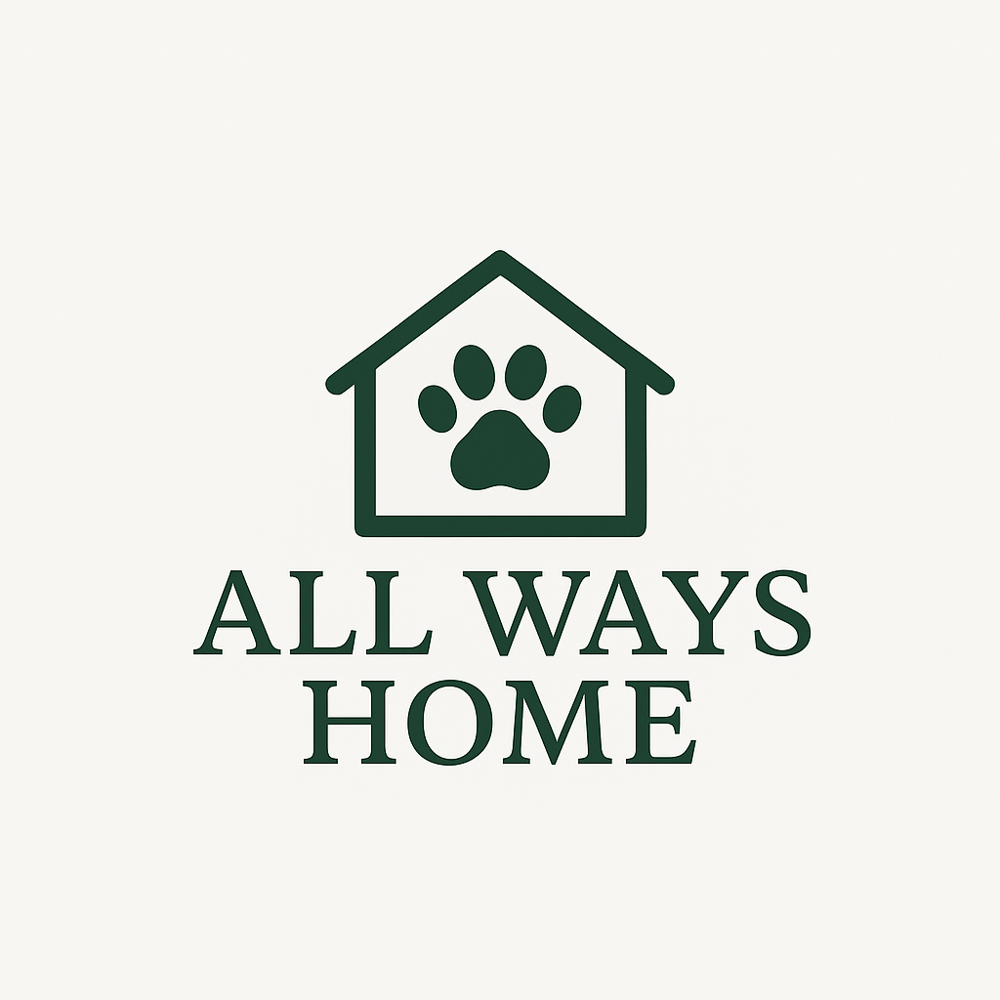

# All Ways Home - House & Pet Sitting Services



**All Ways Home** is a professional house and pet sitting service based in Ireland, offering reliable, caring, and experienced home care services. This is the official website built with Next.js and TailwindCSS.

## 🏠 About All Ways Home

We're a mature, experienced couple offering bespoke home and pet care across Ireland. After years of trusted house sits, we now offer professional, paid services under our own name.

### Our Services

- **🐾 Pet Care** - Feeding, walks, companionship, and love for your furry family members
- **🏠 House Care** - Plants, bins, laundry, post collection, and maintaining your home
- **🔒 Security Presence** - Occupied look for your home, giving you complete peace of mind
- **⭐ Custom Extras** - We adapt to your specific needs and requirements

### Why Choose Us

- ✅ **Fully Insured** - Complete peace of mind with comprehensive insurance coverage
- 🏆 **Experienced** - Years of trusted house sitting experience across Ireland
- 💚 **Caring** - Your pets and home receive the same love and care as our own

## 🚀 Technical Stack

- **Framework**: Next.js 15.1.6 with App Router
- **Language**: TypeScript 5.7.3
- **Styling**: TailwindCSS 4.0.3
- **Animations**: AOS (Animate On Scroll)
- **Forms**: Web3Forms API integration
- **Hosting**: Ready for deployment on Vercel or similar platforms

## 🛠️ Development

### Getting Started

```bash
# Install dependencies
npm install

# Set up environment variables
cp .env.example .env.local
# Edit .env.local with your actual API keys

# Run development server
npm run dev

# Build for production
npm run build

# Start production server
npm start
```

Open [http://localhost:3000](http://localhost:3000) to view the website.

### Environment Variables

Create a `.env.local` file in the root directory with the following variables:

```env
# Web3Forms API Key
# Get your API key from https://web3forms.com/
NEXT_PUBLIC_WEB3FORMS_KEY=your_web3forms_api_key_here
```

**Important**: Never commit `.env.local` to version control. Use `.env.example` as a template.

### Project Structure

```
├── app/                    # Next.js app directory
│   ├── (auth)/            # Authentication pages
│   ├── (default)/         # Main site pages
│   ├── api/               # API routes
│   └── css/               # Global styles
├── components/            # React components
│   ├── ui/               # UI components (header, footer, etc.)
│   └── ...               # Page-specific components
├── public/               # Static assets
│   └── images/           # Images and icons
└── utils/                # Utility functions
```

## 🎨 Design System

The website uses a custom "Homestead" color palette:

- **Base**: `#f8f5f2` - Warm, welcoming background
- **Heading**: `#386641` - Deep forest green for headings
- **Secondary**: `#6a994e` - Medium green for secondary elements
- **Accent**: `#a7c957` - Bright lime for accents and highlights

## 🔐 Security Features

- **Spam Protection**: Multi-layer spam detection for contact forms
- **Email Obfuscation**: Protected email addresses from scraping
- **Rate Limiting**: Form submission rate limiting
- **CAPTCHA**: Math-based verification system
- **Honeypot Fields**: Hidden fields to catch bots

## 📱 Features

- **Responsive Design**: Mobile-first approach for all devices
- **SEO Optimized**: Comprehensive metadata and Open Graph tags
- **Performance**: Optimized images and lazy loading
- **Accessibility**: ARIA labels and keyboard navigation
- **Social Media**: Links to Facebook, Instagram, LinkedIn, and Bluesky

## 🌐 Deployment

The website is configured for deployment on Vercel:

```bash
# Deploy to production
npm run build
```

Environment variables needed:

- `NEXT_PUBLIC_WEB3FORMS_KEY` - Web3Forms API key for contact form

## 📞 Contact

- **Website**: [https://allwayshome.ie](https://allwayshome.ie)
- **Email**: Available through contact form (spam-protected)
- **Facebook**: [@AllWaysHomeIE](https://www.facebook.com/people/All-Ways-Home-IE/61578356010210/)
- **Instagram**: [@allwayshomeie](https://www.instagram.com/allwayshomeie/)
- **LinkedIn**: [All Ways Home IE](https://www.linkedin.com/company/all-ways-home-ie)

## 📄 License

All Rights Reserved - All Ways Home © 2025

This website and its content are proprietary to All Ways Home house and pet sitting services.

---

_Professional house and pet sitting services across Ireland - Your home secure, your pets happy_ 🏠🐾❤️
